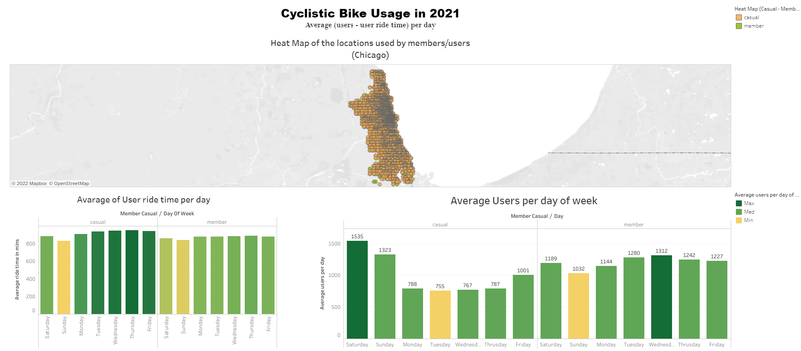
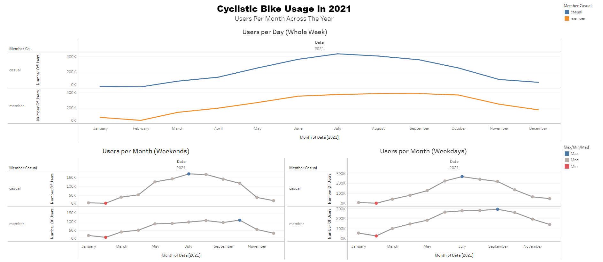
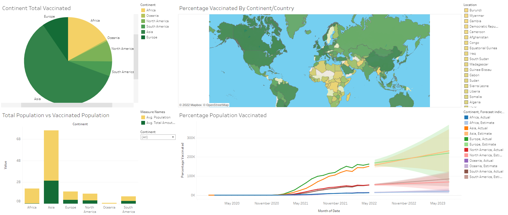

# MK-Portfolio
Data Analyst Portfolio

## [Project 1: Google Data Analytics Capstone Project (Bike-Share Company Future Success)](https://github.com/Muhanned-Kamar/Project-1-GDAPC-Capstone-project)

- Organized, sorted, and saved data in a way to help make the data easier to understand and access.
- Gone through more than 5 million rides per year over 12 tables to insure the credibility and integrity of the data.
- Filtered, sorted, organized, and cleaned data to insure that the data is not bias.
- Used BigQuery (SQL) as the analysis tool which better works with large datasets.
- Analyzied data to get the optimum outcome from the available data to answer the business questions.
- Used tableau as my data visualization tool to show insights and trends.
- Gave recommendation which depends on the facts from the data.

### [Dashboard (Average User Usage & Ride Time)](https://public.tableau.com/app/profile/muhanned1728/viz/Cyclistic_Project/Dashboard1)

### [Dashboard (Users Usage Thoughout The Year)](https://public.tableau.com/app/profile/muhanned1728/viz/Cyclistic_Project_2/Dashboard1)

## [Project 2: Covid-19 Data Exploration](https://github.com/Muhanned-Kamar/Covid-19_Data_Exploration_Project)

- Explored the data using Microsoft SQL Server which gave me a new software to use and explora data with.
- Viewed the data to get a better understanding of it and what can I get from it so I can tell a story using a vizualization tool.
- After viewing the data I found more than one way to get some useful information like new deaths, new cases, new vaccination ,etc. .
- Sorted, organized and made more than one table experssing the useful information in the dataset.

## [Project 3: Covid-19 Data Vizualization](https://github.com/Muhanned-Kamar/Covid-19_Data_Visualization)

- After Explorating the data in [Project 2](https://github.com/Muhanned-Kamar/Covid-19_Data_Exploration_Project) now it is time get some table from the queries to show the findings
- Made to Vizualizations each for Covid-19 Deaths and Covid-19 Vaccination.
- The data used from those queries would make us better understand what happend to the continent/countries(Location in the dataset)
- Used Tableau as the data vizualization tool to show findings and differences between continent/countries and how they dealt with the pandemic

### [DashBoard (Covid-19 Deaths)](https://public.tableau.com/app/profile/muhanned1728/viz/Covid-19_Project_Deaths/Dashboard1)

### [DashBoard (Covid-19 Vaccination)](https://public.tableau.com/app/profile/muhanned1728/viz/Covid-19_Project_Vac/Dashboard1)

## [Project 4: Nashville Housing Data Cleaning Project](https://github.com/Muhanned-Kamar/Nashville_Housing_Data_Cleaning_Project)

